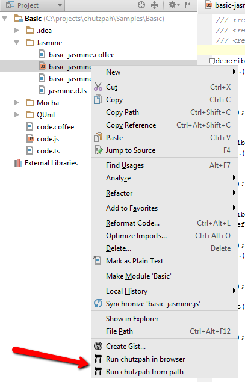
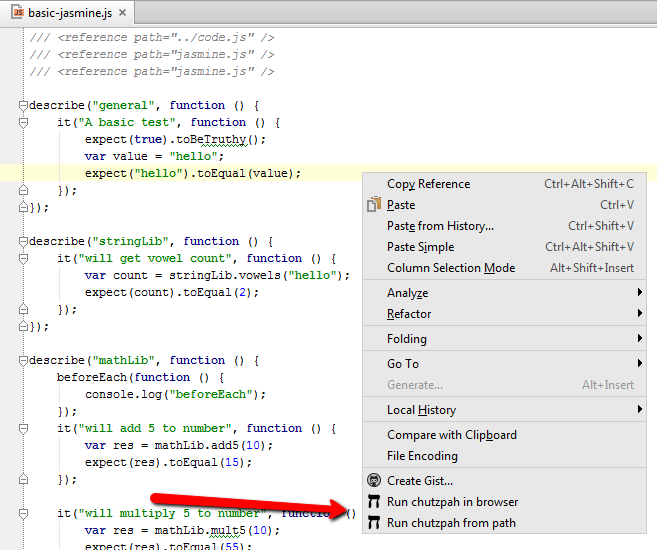
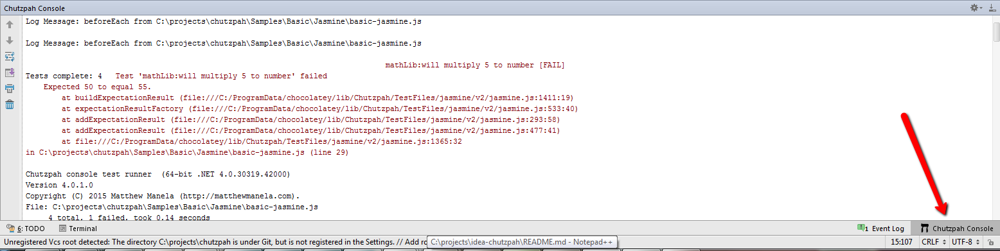

### idea-chutzpah
plugin for running jasmine(Mocha/QUnit) unit test in WebStorm (and other Intellij Idea IDE), It's used `chutzpah.console` command line tools and working only in windows.

#### install

1. make sure you have installed chocolatey
2. install chutzpah as global package with chocolatey
```
choco install chutzpah
```
more details: https://chocolatey.org/packages/chutzpah
3. download and install plugin to WebStorm(or other intellij idea editors): [idea-chutzpah.jar](idea-chutzpah.jar
"plugin")


#### using

plugin add 2 actions to context menu in projects tree and editor area




`Run chutzpah in browser` - it's open in default browser page with jasmine test of selected file (useful for
debugging).
`Run chutzpah from path` - it's run all test files inside chosen directory or selected test file result will be shown
 in internal console.

